# Email Responder AI Agent

An AI-powered customer support email responder that automates replies by understanding customer intent, selecting an appropriate tone, and generating brand-consistent responses using GPT-4. It provides a review/edit interface before sending, ensuring quality and human oversight.

---

## Features

-  **Intent Classification** — Understands email context (e.g., shipping, refund, complaint)
-  **Tone Selection** — Chooses the right tone (apologetic, friendly, formal)
-  **GPT-4 Reply Generation** — Produces thoughtful and professional replies using brand guidelines
-  **Review/Edit Interface** — Enables manual approval or edits before sending
-  **Email Integration** — Connects to Gmail (or other providers) to fetch and send emails
-  **Modular LangGraph Flow** — Each step in the AI pipeline is a structured node in a LangGraph

---

##  Architecture

```mermaid
graph TD
    A[📥 Incoming Email] --> B[🔍 Intent Classifier]
    B --> C[🎭 Tone Selector]
    C --> D[✏️ GPT-4 Reply Generator]
    D --> E[🖊️ Review/Edit in Streamlit]
    E --> F[📤 Send via Email API]
```


- Built on LangChain and LangGraph for structured, chainable components
- Frontend in Streamlit for fast prototyping and human-in-the-loop review
- Gmail API integration for live email processing

---

## Tech Stack

| Layer     | Technology               |
| --------- | ------------------------ |
| LLM       | OpenAI GPT-4             |
| Chaining  | LangChain                |
| Workflow  | LangGraph                |
| UI        | Streamlit                |
| Email API | Gmail API (Google Cloud) |
| Auth      | OAuth 2.0 (Gmail)        |
| Hosting   | Streamlit Cloud / Local  |

---

## Installation 

```bash
git clone https://github.com/yourusername/email-responder-ai-agent.git
cd email-responder-ai-agent
python -m venv venv
source venv/bin/activate  # on Windows: venv\Scripts\activate
pip install -r requirements.txt
```

---

## Environment Variables

Create a .env file:
```bash
OPENAI_API_KEY=your_openai_key
GMAIL_CLIENT_SECRET=your_gmail_client_secret.json
```

---

## Usage
```bash
streamlit run app.py
```

In the Streamlit UI:
- View unread emails
- Let the AI classify and generate a response
- Review and edit the reply
- Send the email with one click

---

## Project Structure

```bash
email_responder_ai/
│
├── app.py                  # Streamlit frontend
├── config.py               # API keys, brand voice
├── email_client.py         # Gmail API integration
├── intent_classifier.py    # Classify email intent
├── tone_selector.py        # Select appropriate tone
├── response_generator.py   # Generate reply with GPT-4
├── review_editor.py        # UI for editing responses
├── langgraph_flow.py       # Multi-step workflow with LangGraph
├── utils.py                # Helpers and logging
├── requirements.txt        # Dependencies
└── README.md
```

---

## Acknowledgements

This project was made possible thanks to the following amazing tools and platforms:

- [**OpenAI**](https://openai.com/) — Provider of the GPT-4 large language model used for intent understanding and response generation.
- [**LangChain**](https://www.langchain.com/) — Framework for developing LLM-powered applications through modular chains and prompts.
- [**LangGraph**](https://www.langgraph.dev/) — Structured, graph-based execution framework built on top of LangChain for controlling complex workflows.
- [**Streamlit**](https://streamlit.io/) — Python-based web framework used to create the review/edit UI for human-in-the-loop interaction.
- [**Google Gmail API**](https://developers.google.com/gmail/api) — Email API integration used to fetch and send emails from Gmail accounts.
